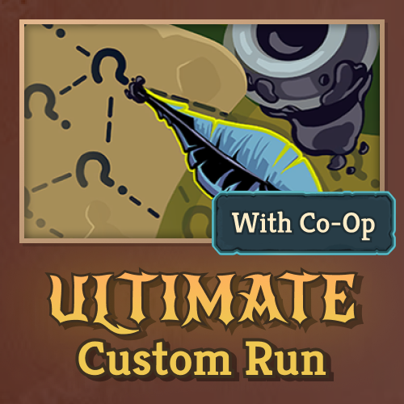
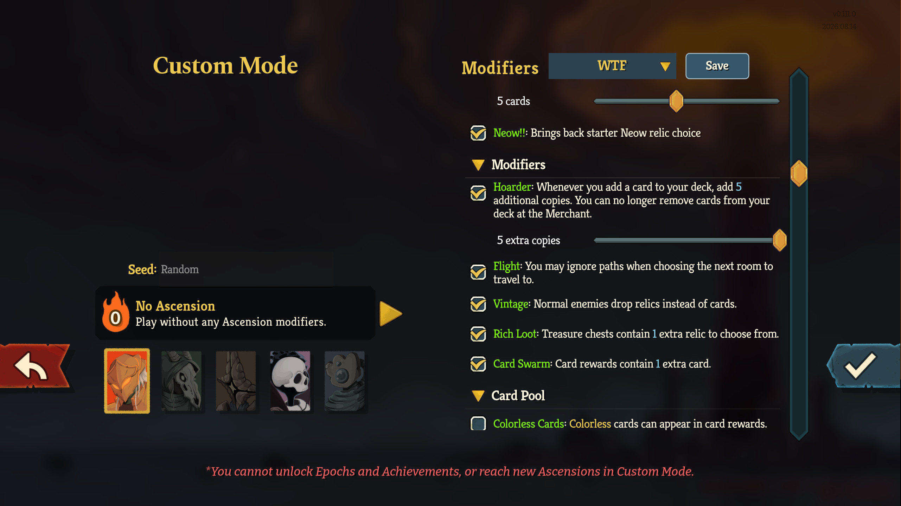
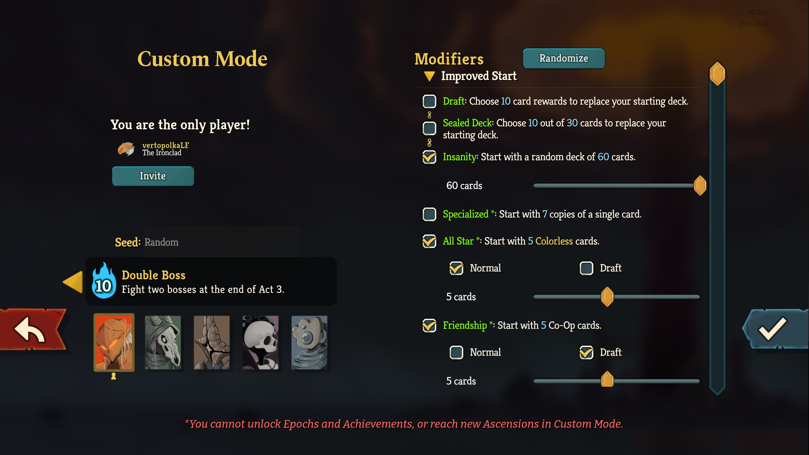
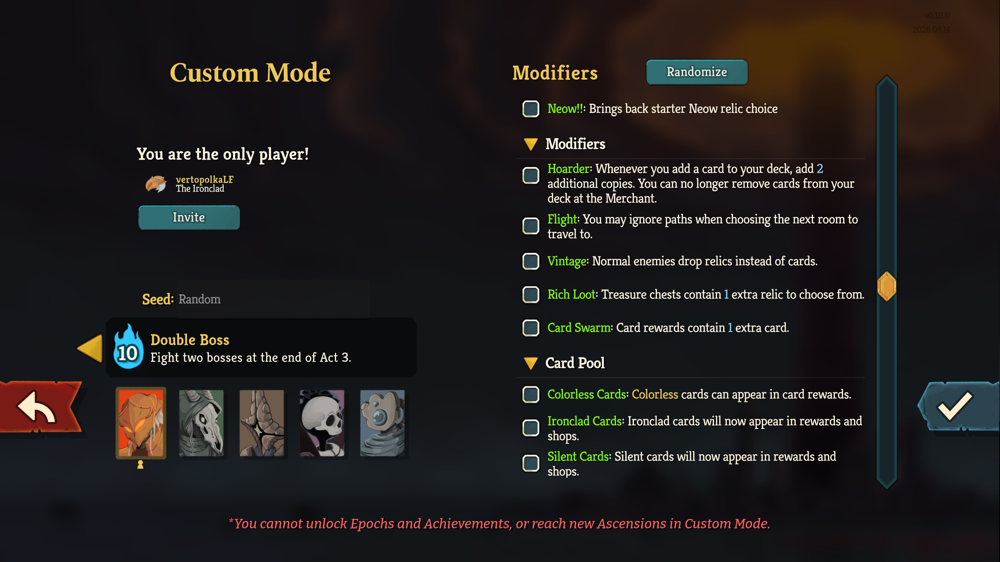
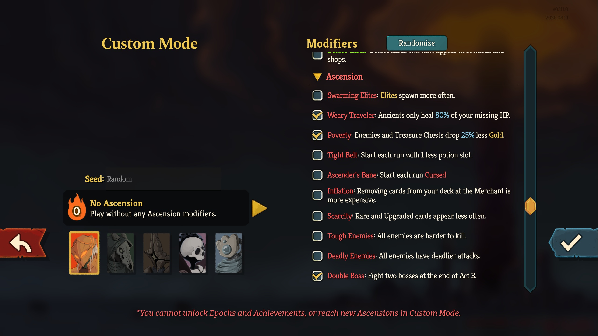

# Ultimate Custom Run

Customize **Slay the Spire 2** custom runs with native value sliders, new modifier variants, extra rewards, and an organized selection menu.

[Steam Workshop](https://steamcommunity.com/sharedfiles/filedetails/?id=3811713944) · [Report a bug](https://github.com/vertopolkaLF/ultimate-custom-run/issues/new/choose) · [Contributing](CONTRIBUTING.md) · [GPL-3.0 license](LICENSE)

**Version 1.7.0 · Pre-release · Built against game v0.111.0.** Available publicly on Steam Workshop and GitHub.



## Features

- Collapsible modifier groups: **Improved Start**, **Run Parameters**, **Modifiers**, **Card Pool**, **Ascension**, and **Negatives**. Options unavailable in singleplayer appear under **Disabled**.
- **Run Parameters** can set bosses per act (vanilla, 1, or 2), floors per act (vanilla or 8–30), base hand size (vanilla or 0–15), base energy (vanilla or 0–10), and enemy HP, enemy damage, and player HP multipliers (25–500%, step 25%).
- Named modifier presets: save the current selection and slider values as a loadout, then restore it from the dropdown. **Empty** clears the selected modifiers. Delete saved loadouts with the game's remove icon beside each dropdown item; deleting a loadout preserves the current run settings. Presets are stored locally, and the built-in Empty preset cannot be overwritten or removed.
- **Ascension** contains all ten Ascension effects as independent options, using the game's localized titles and descriptions. For example, enable Double Boss without any other Ascension penalties. Enabling an effect sets Ascension to 0; changing Ascension disables every independent Ascension option while preserving other modifiers.
- Native sliders with live value labels and descriptions. Use the mouse or focus a slider and press left/right to change it by one step.
- Linked mutually exclusive choices. Specialized, All Star, and Friendship keep their variants together under one checkbox.
- Values persist in saves and synchronize from the co-op host.
- Custom-only modifiers stay out of the Daily Challenge pool. Vanilla Daily values are preserved.
- No BaseLib dependency or additional PCK file.

## Screenshots

**Named modifier presets**



**Starting decks and native value sliders**



**Extra rewards and card pools**



**Individual Ascension effects**



## Adjustable values

Enable a modifier to reveal its slider. Original values remain the defaults.

| Modifier | Range | Step | Default |
| --- | --- | --- | --- |
| Specialized, All Star, Friendship | 1–10 cards or copies | 1 | 5 |
| Draft | 5–20 cards | 5 | 10 |
| Sealed Deck — cards to choose | 5–(pool size − 5) cards | 5 | 10 |
| Sealed Deck — card pool | 10–60 offers | 5 | 30 |
| Insanity | 5–60 cards | 5 | 30 |
| Hoarder | 1–5 additional copies | 1 | 2 |
| Midas | 150–300% of normal gold rewards | 5% | 200% |

Run Parameters use the game's defaults until a value is changed. The boss setting supports one or two bosses because the native act map has a primary and a second boss slot. Parameter values are saved with runs and presets, and synchronized from the co-op host.

Normal, Draft, and Pick Any share the same value within a modifier family. Sealed Deck has two sliders: cards to choose and pool size. The first slider's maximum is always the second slider's value minus 5; reducing the pool automatically clamps the chosen-card count. Both values persist in saves, co-op settings, and presets. Extra Card Choice / Card Swarm does not enlarge the configured pool. Hoarder counts copies **in addition to** the original card and still blocks Merchant card removal. Midas uses a percentage of the normal gold reward, rounded down: 200% means twice the gold. It still blocks Smithing at Rest Sites.

## New options

| Option | Effect |
| --- | --- |
| **Neow!!** | Restores the usual starter relic choice after the other starting effects. |
| **Headstart** | Choose 1–5 distinct relics at Neow (step 1, default 1). Uses compendium relic tiles in a searchable, scrolling selection grid with native hover tips and explicit confirmation. Includes all unlocked, character-compatible rarities, including Ancient, Event, Shop, and other available Starter relics, subject to native Neow restrictions. Already-owned non-stackable relics are excluded. Each co-op player chooses independently through synchronized choice indexes; normal pickup effects remain active. The count persists in saves and presets. |
| **Ultimate Starter** | Replaces the normal basic Strikes and Defends with 3 Ultimate Strikes and 3 Ultimate Defends, preserving special starter cards such as Bash and Zap. Applies once when creating a run, for every co-op player. Draft, Sealed Deck, and Insanity replace the whole deck afterward if selected. |
| **Super Draft** | Add card rewards to your starting deck until you pass. Each pick risks a Curse: 0.5%, doubling each offer. At 128%, gain one guaranteed Curse plus a 28% chance of another. Passing adds no Curse; each player drafts independently. |
| **Must Have (negative)** | Requires taking a card from every card reward before leaving. Rerolls remain available; non-card rewards remain optional. Passing during Super Draft is allowed. |
| **Speedrun (negative)** | Every full minute after the selected time limit, lose 5 HP. Limit: 10–60 minutes, step 5, default 30. Uses the native run timer, including its singleplayer pause behavior. Elapsed time and applied penalties persist in saves; the host schedules penalties for all players in co-op. |
| **Dill (negative)** | Start with 1 max HP and gain 2 max HP after each combat victory. Two sliders: initial HP 1–20 (step 1, default 1) and max HP per fight 1–5 (step 1, default 2). Current HP starts at the selected maximum, which overrides initial Ascension/HP scaling. Growth uses the game's normal max-HP gain and healing for surviving players in co-op. Both sliders persist in saves, co-op settings, and presets; loading does not reset earned max HP. |
| **Specialized — Normal** | Adds the selected number of copies of a random eligible card. |
| **Specialized — Draft** | Choose one Card Reward, then add the selected number of copies. Skipping adds no cards. |
| **Specialized — Pick Any** | Choose an eligible common, uncommon, or rare card from your character's pool, then add the selected number of copies. |
| **All Star — Draft** | Choose Colorless card rewards instead of receiving random Colorless cards. Each accepted reward adds one card. |
| **Friendship — Normal** | Adds the selected number of copies of a random Co-Op card from your character's pool. Co-op only. |
| **Friendship — Draft** | Choose the selected number of Co-Op card rewards. Each accepted reward adds one card. Co-op only. |
| **Colorless Cards** | Allows Colorless cards in card rewards through the native Dingy Rug relic. An existing copy is not granted again. |
| **Rich Loot** | Treasure chests contain one extra relic to choose from. Empty chests remain empty. |
| **Card Swarm** | Card rewards contain one extra offer, including standard Draft rewards and the mod's starting drafts. Fixed tutorial rewards are unchanged. |

Variants within each family are mutually exclusive. Draft, Sealed Deck, and Insanity are mutually exclusive. Super Draft adds cards after deck replacement and can be combined with those options. All Star and Friendship draft rewards can be skipped unless Must Have is enabled. Standard reward-generation hooks remain active, so other effects can modify offers; Sealed Deck keeps its configured pool size.

## Install and play

### Steam Workshop

Subscribe to [Ultimate Custom Run](https://steamcommunity.com/sharedfiles/filedetails/?id=3811713944), then let Steam download it.

### Local package

Copy these two files from `content/UltimateCustomRun/` into `<game-folder>/mods/UltimateCustomRun/`:

```text
UltimateCustomRun.dll
UltimateCustomRun.json
```

The repository includes the packaged DLL; you can also build it yourself using the instructions below. Do not copy the entire build output or the game's dependencies into `mods`.

### In the game

1. Fully restart the game after installing or updating the mod.
2. Enable **Ultimate Custom Run** in **Settings → Mod Settings**.
3. Start a **Custom Run**, select modifiers and adjust their values. Use the loadout dropdown to restore a preset or **Save** to store the current selection.
4. Resolve the selected starting effects at Neow.

Every co-op player needs the same mod version. Only the host can change slider values. Keep one active installation: do not enable the old **SpecializedChoice** mod alongside Ultimate Custom Run, or duplicate models may conflict at startup.

## Build from source

Requirements: Windows, **.NET SDK 9 or later**, and an installed Windows copy of Slay the Spire 2. The project references `sts2.dll`, `GodotSharp.dll`, and `0Harmony.dll` from the game's `data_sts2_windows_x86_64` directory. These dependencies are not included in this repository.

Run PowerShell from the repository root:

```powershell
# Build the Release DLL, refresh the package, and create a ZIP.
.\build.ps1

# Build and install locally using the default Steam library.
.\build.ps1 -Install

# Use a different Steam library.
.\build.ps1 -GamePath 'E:\SteamLibrary\steamapps\common\Slay the Spire 2' -Install
```

The default game path is `C:\Program Files (x86)\Steam\steamapps\common\Slay the Spire 2`. Outputs are `content/UltimateCustomRun/` and `artifacts/UltimateCustomRun-1.7.0.zip`.

An open game can lock the installed DLL. Close the game before a manual update, or use the staged replacement procedure in [AGENTS.md](AGENTS.md). Updating files is not hot reload: a full restart is required to load the new code.

## Testing and compatibility

```powershell
dotnet run --project tests/Smoke -c Release

# Both the build references and the runtime resolver need the custom path.
dotnet run --project tests/Smoke -c Release '-p:Sts2Path=E:\SteamLibrary\steamapps\common\Slay the Spire 2' -- 'E:\SteamLibrary\steamapps\common\Slay the Spire 2'
```

The smoke suite patches the installed game assembly and checks registration, save and network-property serialization, cloning, slider ranges, native count patches, Midas gold rewards, draft selection, modifier grouping, and exclusivity. It also compares modifier selection for 100 Daily seeds with and without the mod's patches.

**These are managed integration checks, not an in-game playtest.** UI layout, input, actual deck acquisition, and live co-op behavior still need testing in the game. Compatibility with later game versions is not guaranteed; changed patch targets can require a mod update.

## Development and publishing

See [CONTRIBUTING.md](CONTRIBUTING.md) for setup, validation, and pull requests, and [AGENTS.md](AGENTS.md) for repository automation rules.

`build.ps1` only builds, packages, and optionally installs locally. Workshop publishing is a separate maintainer action using ModUploader. The current item ID is stored in `mod_id.txt`. Its description and visibility are maintained in `workshop.json`; uploading with a non-null description replaces edits made directly in Steam.

Workshop gallery screenshots are tracked in `previews/`. Keep every gallery image you want to retain there: ModUploader synchronizes that folder and removes additional previews missing from it. Screenshots are displayed in the Workshop gallery and this README; the Workshop description contains text only.

## License

Original project code and documentation are licensed under **GNU GPL version 3 only** (`GPL-3.0-only`); see [LICENSE](LICENSE). Copyright © 2026 vertopolkaLF.

Slay the Spire 2 and its game assets and dependencies belong to their respective owners and are not relicensed by this project. This is an unofficial community mod, not affiliated with or endorsed by Mega Crit.
